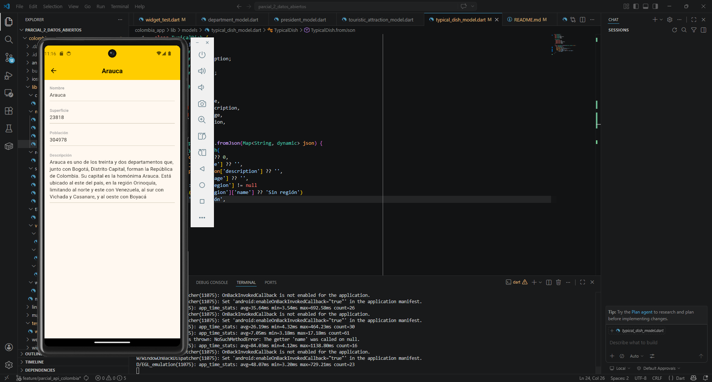
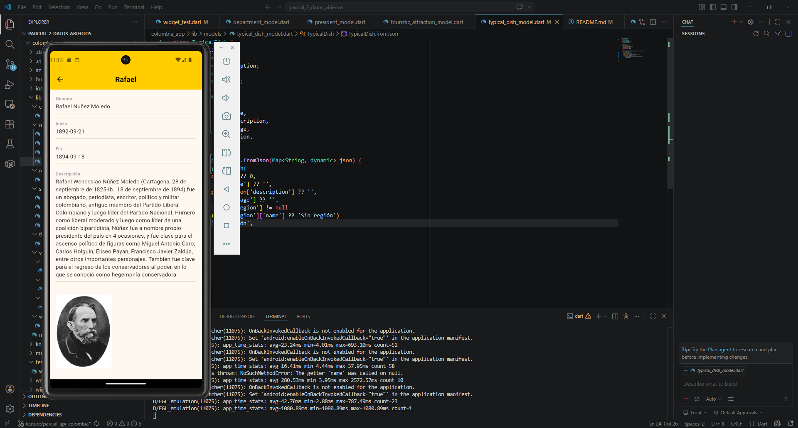
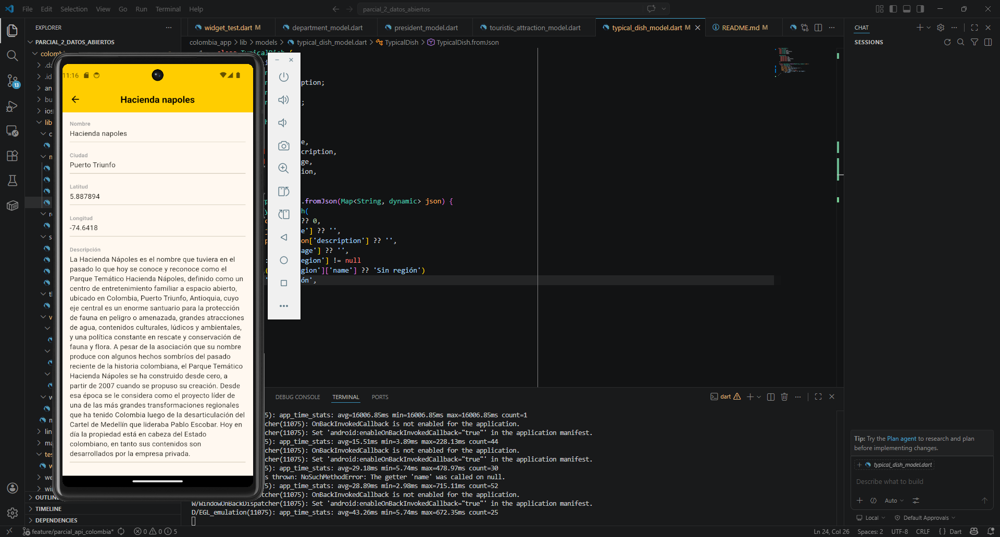
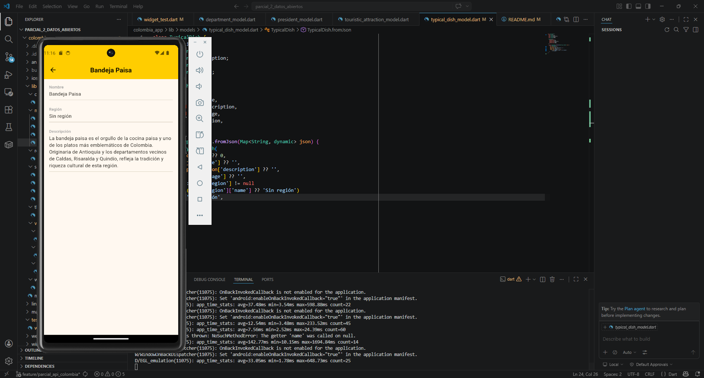
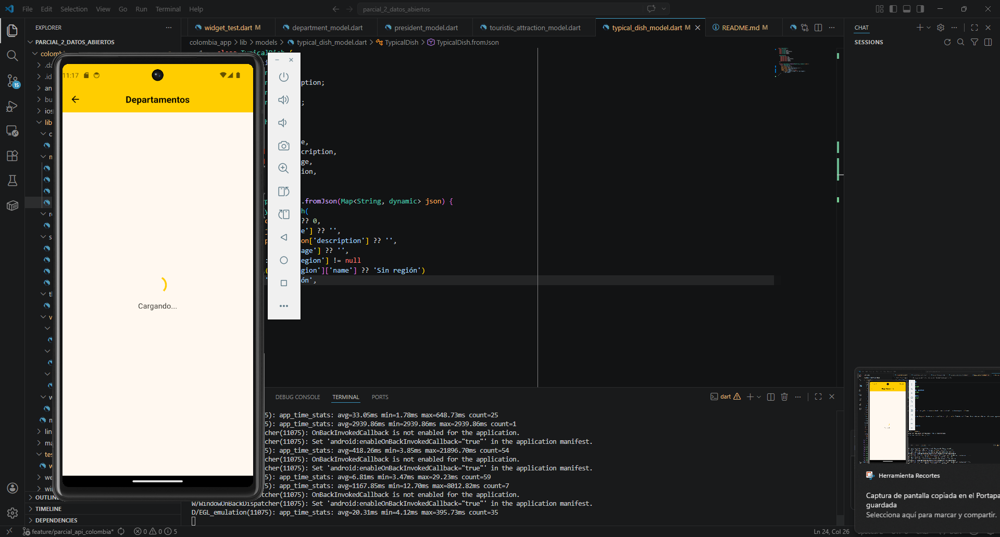
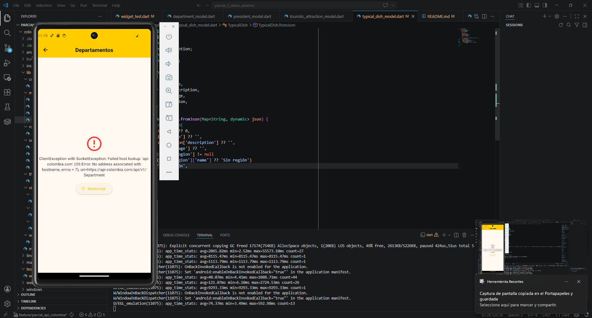

# Colombia App

Aplicación móvil desarrollada en **Flutter** como proyecto de la asignatura **Electiva Profesional I** en la Unidad Central del Valle del Cauca (UCEVA). Consume datos abiertos de Colombia a través de la API pública **API Colombia**, mostrando información sobre departamentos, presidentes, atracciones turísticas y platos típicos del país.

---

## Tabla de contenidos

1. [Descripción de la API](#descripción-de-la-api)
2. [Endpoints seleccionados](#endpoints-seleccionados)
3. [Arquitectura y estructura del proyecto](#arquitectura-y-estructura-del-proyecto)
4. [Rutas con go_router](#rutas-con-go_router)
5. [Manejo de estados](#manejo-de-estados)
6. [Ejemplos de respuesta JSON](#ejemplos-de-respuesta-json)
7. [Capturas de pantalla](#capturas-de-pantalla)
8. [Cómo ejecutar el proyecto](#cómo-ejecutar-el-proyecto)
9. [Dependencias](#dependencias)

---

## Descripción de la API

**API Colombia** es una API REST pública y gratuita que provee información verificada sobre Colombia: geografía, cultura, historia, turismo e instituciones del país. No requiere autenticación para su uso.

- 🌐 **Sitio oficial:** https://api-colombia.com
- 📄 **Documentación Swagger:** https://api-colombia.com/swagger/index.html
- 📦 **Base URL:** `https://api-colombia.com/api/v1`
- 🔒 **Autenticación:** No requerida
- 📋 **Formato de respuesta:** JSON
- 📊 **Solicitudes mensuales:** +2 millones

---

## Endpoints seleccionados

Se seleccionaron 4 endpoints que ofrecen datos ricos y variados para demostrar el patrón Dashboard → Listado → Detalle:

| # | Endpoint | URL base | Descripción |
|---|---|---|---|
| 1 | **Department** | `/api/v1/Department` | Los 32 departamentos de Colombia con superficie, población y descripción |
| 2 | **President** | `/api/v1/President` | Todos los presidentes de Colombia con período de gobierno e imagen |
| 3 | **TouristicAttraction** | `/api/v1/TouristicAttraction` | Atracciones turísticas con coordenadas y ciudad |
| 4 | **TypicalDish** | `/api/v1/TypicalDish` | Platos típicos colombianos con región e imagen |

### Endpoints usados por pantalla

| Pantalla | Método | URL completa | Descripción |
|---|---|---|---|
| Listado Departamentos | GET | `/api/v1/Department` | Trae todos los departamentos |
| Detalle Departamento | GET | `/api/v1/Department/{id}` | Trae un departamento por ID |
| Listado Presidentes | GET | `/api/v1/President` | Trae todos los presidentes |
| Detalle Presidente | GET | `/api/v1/President/{id}` | Trae un presidente por ID |
| Listado Atracciones | GET | `/api/v1/TouristicAttraction` | Trae todas las atracciones |
| Detalle Atracción | GET | `/api/v1/TouristicAttraction/{id}` | Trae una atracción por ID |
| Listado Platos | GET | `/api/v1/TypicalDish` | Trae todos los platos típicos |
| Detalle Plato | GET | `/api/v1/TypicalDish/{id}` | Trae un plato típico por ID |

---

## Arquitectura y estructura del proyecto

El proyecto sigue una arquitectura en capas que separa claramente las responsabilidades de cada componente:

```
colombia_app/
├── lib/
│   ├── config/
│   │   └── app_config.dart                  # Lee BASE_URL desde .env
│   │
│   ├── models/
│   │   ├── department_model.dart            # Modelo Department con fromJson
│   │   ├── president_model.dart             # Modelo President con fromJson
│   │   ├── touristic_attraction_model.dart  # Modelo TouristicAttraction
│   │   └── typical_dish_model.dart          # Modelo TypicalDish con fromJson
│   │
│   ├── routes/
│   │   └── app_router.dart                  # Configuración centralizada de go_router
│   │
│   ├── services/
│   │   ├── department_service.dart          # Llamadas HTTP para Department
│   │   ├── president_service.dart           # Llamadas HTTP para President
│   │   ├── touristic_service.dart           # Llamadas HTTP para TouristicAttraction
│   │   └── typical_dish_service.dart        # Llamadas HTTP para TypicalDish
│   │
│   ├── themes/
│   │   └── app_theme.dart                   # Tema visual (colores bandera de Colombia)
│   │
│   ├── views/
│   │   ├── dashboard/
│   │   │   └── dashboard_view.dart          # Pantalla principal con las 4 cards
│   │   ├── listado/
│   │   │   └── listado_view.dart            # Listado genérico para los 4 endpoints
│   │   └── detalle/
│   │       └── detalle_view.dart            # Detalle de cada registro
│   │
│   ├── widgets/
│   │   └── estado_widget.dart               # Widget reutilizable cargando/éxito/error
│   │
│   └── main.dart                            # Punto de entrada, carga .env
│
├── .env                                     # Variables de entorno (BASE_URL)
└── pubspec.yaml                             # Dependencias del proyecto
```

### Descripción de cada capa

**`config/`** — Lee las variables de entorno del archivo `.env` usando `flutter_dotenv` y las expone a través de `AppConfig.baseUrl`. Centraliza la configuración para evitar URLs hardcodeadas en el código.

**`models/`** — Define las clases Dart que representan los datos de la API. Cada modelo implementa un constructor `fromJson` que convierte el `Map<String, dynamic>` del JSON en un objeto tipado. Usa el operador `??` para manejar valores nulos de forma segura.

**`services/`** — Contiene la lógica de comunicación HTTP. Cada servicio usa el paquete `http` para hacer peticiones GET a la API y retorna listas u objetos de los modelos correspondientes. Si el servidor responde con un código distinto a 200, lanza una excepción que es capturada por la vista.

**`routes/`** — Define todas las rutas de la aplicación en un único `GoRouter`. Las rutas usan parámetros de path (`:tipo`, `:id`) para compartir pantallas genéricas entre los 4 endpoints.

**`themes/`** — Define el tema visual de la app usando los colores de la bandera de Colombia: amarillo (`#FFCD00`), azul (`#003087`) y rojo (`#CE1126`).

**`views/`** — Contiene las pantallas organizadas por función. `DashboardView` es `StatelessWidget`. `ListadoView` y `DetalleView` son `StatefulWidget` porque manejan estados de carga.

**`widgets/`** — `EstadoWidget` es un componente reutilizable que recibe flags `cargando` y `error` y renderiza el spinner, el mensaje de error con botón reintentar, o el contenido exitoso según corresponda.

---

## Rutas con go_router

Todas las rutas están definidas centralizadamente en `lib/routes/app_router.dart`:

```dart
final GoRouter appRouter = GoRouter(
  initialLocation: '/',
  routes: [
    GoRoute(
      path: '/',
      builder: (context, state) => const DashboardView(),
    ),
    GoRoute(
      path: '/listado/:tipo',
      builder: (context, state) {
        final tipo = state.pathParameters['tipo']!;
        return ListadoView(tipo: tipo);
      },
    ),
    GoRoute(
      path: '/detalle/:tipo/:id',
      builder: (context, state) {
        final tipo = state.pathParameters['tipo']!;
        final id   = int.parse(state.pathParameters['id']!);
        return DetalleView(tipo: tipo, id: id);
      },
    ),
  ],
);
```

### Tabla de rutas

| Ruta | Parámetros | Pantalla | Descripción |
|---|---|---|---|
| `/` | Ninguno | `DashboardView` | Pantalla principal con las 4 cards |
| `/listado/:tipo` | `tipo`: department, president, touristic, dish | `ListadoView` | Listado del endpoint seleccionado |
| `/detalle/:tipo/:id` | `tipo`: mismo que arriba · `id`: int | `DetalleView` | Detalle del registro seleccionado |

### Cómo se navega

```dart
// Dashboard → Listado (con push para poder volver)
context.push('/listado/department');
context.push('/listado/president');
context.push('/listado/touristic');
context.push('/listado/dish');

// Listado → Detalle (con push, pasando el id del item)
context.push('/detalle/department/5');
context.push('/detalle/president/12');
```

El parámetro `:tipo` permite que `ListadoView` y `DetalleView` sean pantallas **genéricas** que sirven para los 4 endpoints, evitando duplicar código.

---

## Manejo de estados

Cada pantalla de listado y detalle maneja 3 estados mediante `EstadoWidget`:

| Estado | Qué muestra la UI | Cuándo ocurre |
|---|---|---|
| **Cargando** | `CircularProgressIndicator` + texto "Cargando..." | Desde que se lanza el `Future` hasta que resuelve |
| **Éxito** | El contenido solicitado (lista o detalle) | Cuando la API responde con código 200 |
| **Error** | Ícono de error + mensaje + botón "Reintentar" | Cuando la API falla o no hay conexión |

```dart
// Ejemplo de manejo de estados en ListadoView
Future<void> _cargar() async {
  setState(() { _cargando = true; _error = null; });
  try {
    final datos = await DepartmentService().getAll();
    setState(() { _items = datos; _cargando = false; });
  } catch (e) {
    setState(() { _error = e.toString(); _cargando = false; });
  }
}
```

---

## Ejemplos de respuesta JSON

### Department — `GET /api/v1/Department`
🔗 https://api-colombia.com/api/v1/Department

```json
[
  {
    "id": 1,
    "name": "Amazonas",
    "description": "El departamento del Amazonas está ubicado al sur de Colombia...",
    "surface": 109665,
    "population": 76243,
    "cities": [],
    "regions": []
  }
]
```

### President — `GET /api/v1/President`
🔗 https://api-colombia.com/api/v1/President

```json
[
  {
    "id": 1,
    "name": "Simón",
    "lastName": "Bolívar",
    "description": "Simón José Antonio de la Santísima Trinidad Bolívar...",
    "startPeriodDate": "1819-08-10T00:00:00",
    "endPeriodDate": "1819-11-11T00:00:00",
    "image": "https://api-colombia.com/images/presidents/simon_bolivar.jpg",
    "politicalParty": "Independiente"
  }
]
```

### TouristicAttraction — `GET /api/v1/TouristicAttraction`
🔗 https://api-colombia.com/api/v1/TouristicAttraction

```json
[
  {
    "id": 1,
    "name": "Catedral de Sal de Zipaquirá",
    "description": "La Catedral de Sal de Zipaquirá es un templo católico...",
    "latitude": 5.0228,
    "longitude": -74.0097,
    "city": {
      "id": 10,
      "name": "Zipaquirá"
    }
  }
]
```

### TypicalDish — `GET /api/v1/TypicalDish`
🔗 https://api-colombia.com/api/v1/TypicalDish

```json
[
  {
    "id": 1,
    "name": "Bandeja Paisa",
    "description": "La bandeja paisa es un plato típico de la región andina...",
    "image": "https://api-colombia.com/images/dishes/bandeja_paisa.jpg",
    "region": {
      "id": 2,
      "name": "Andina"
    }
  }
]
```

---

## Capturas de pantalla

### Dashboard
> 

---

### Listado — Departamentos
> 

### Listado — Presidentes
> 

### Listado — Atracciones Turísticas
> 

### Listado — Platos Típicos
> 

---

### Detalle — Departamento
> 

### Detalle — Presidente
> 

### Detalle — Atracción Turística
> 

### Detalle — Plato Típico
> 

---

### Manejo de estados

#### Estado — Cargando
> 

#### Estado — Error
> 

---

## Cómo ejecutar el proyecto

### Requisitos previos
- Flutter SDK 3.x instalado
- Android Studio con emulador configurado (API 34 recomendado)
- VS Code con extensiones Flutter y Dart

### Pasos

```bash
# 1. Clonar el repositorio
git clone https://github.com/Diego3126/parcial_2_datos_abiertos.git
cd colombia_app

# 2. Instalar dependencias
flutter pub get

# 3. Verificar el entorno
flutter doctor

# 4. Ejecutar la app
flutter run
```

### Archivo .env
El proyecto requiere un archivo `.env` en la raíz con el siguiente contenido:
```
BASE_URL=https://api-colombia.com/api/v1
```

### Comandos útiles durante el desarrollo
```bash
r   # Hot Reload — recarga la UI sin perder estado
R   # Hot Restart — reinicia la app completamente
q   # Salir
```

---

## Dependencias

```yaml
dependencies:
  http: ^1.6.0           # Peticiones HTTP GET a la API Colombia
  go_router: ^17.2.2     # Navegación declarativa entre pantallas
  flutter_dotenv: ^6.0.0 # Variables de entorno desde archivo .env
```

| Paquete | Uso en el proyecto |
|---|---|
| `http` | Hace las peticiones GET a cada endpoint de API Colombia en los `services/` |
| `go_router` | Gestiona la navegación Dashboard → Listado → Detalle con parámetros de path |
| `flutter_dotenv` | Carga la `BASE_URL` desde `.env` para no hardcodear URLs en el código |

---

## Referencias

- [API Colombia — Sitio oficial](https://api-colombia.com)
- [API Colombia — Swagger](https://api-colombia.com/swagger/index.html)
- [Flutter HTTP package](https://pub.dev/packages/http)
- [go_router — pub.dev](https://pub.dev/packages/go_router)
- [flutter_dotenv — pub.dev](https://pub.dev/packages/flutter_dotenv)
- [Flutter Docs — Networking](https://docs.flutter.dev/cookbook/networking/fetch-data)

---

*Proyecto desarrollado por Diego Fernando España Valderrama · Electiva Profesional I · UCEVA 2026*
